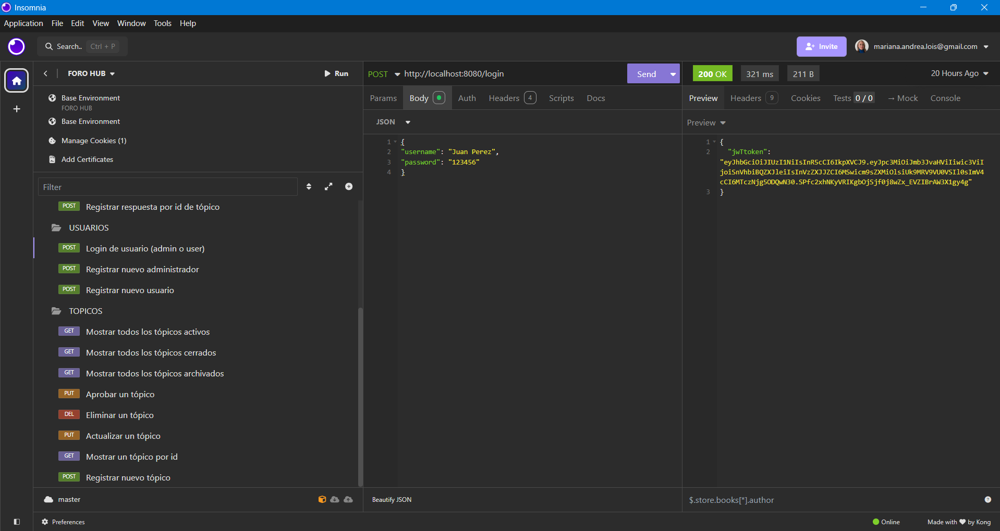
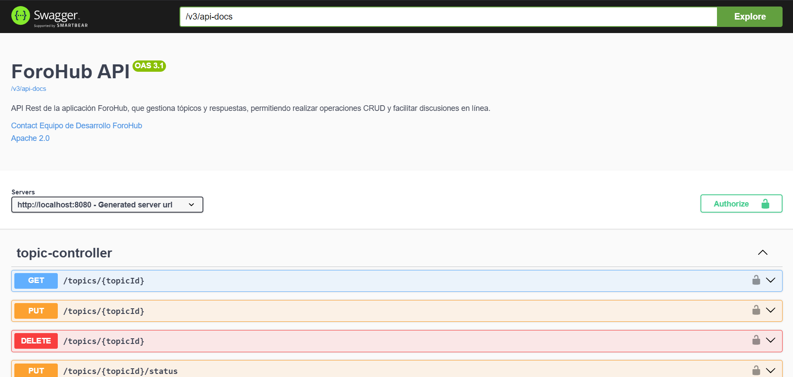
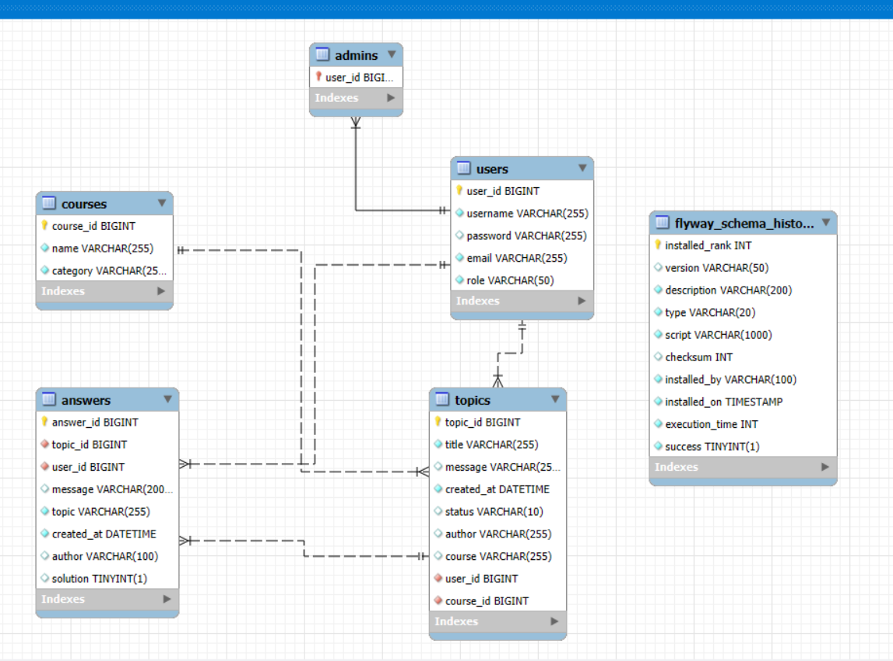
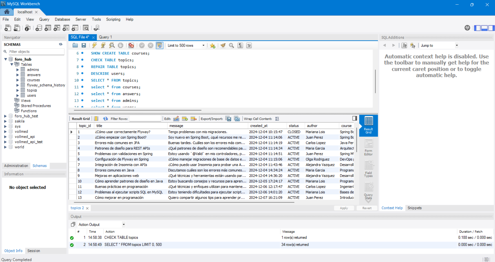

# ForoHub API: Foro educativo de programación y desarrollo de software.

# Desarrollado por: Mariana Andrea Lois (Lady Marianne).

ForoHub es un foro educativo para discutir y aprender sobre diferentes tópicos relacionados con 
los siguientes temas:

- Desarrollo backend y frontend.
- DevOps.
- Ingeniería de software.
- Bases de datos.

Los usuarios pueden crear tópicos, responder a ellos, y editar tanto tópicos como respuestas dentro 
de un marco de reglas de tiempo específicas. La API está construida con **Spring Boot** y utiliza
JWT para su autenticación.

## Descripción:

Esta aplicación es un foro donde los usuarios pueden:
- Crear y editar tópicos.
- Responder a los tópicos existentes.
- Editar los tópicos y las respuestas dentro de una hora desde la publicación.
- Respetar restricciones de horario para realizar publicaciones (7:00 AM a 11:59 PM).

## Funcionalidades:

### Tópicos:
- **POST /topics**: Crear un nuevo tópico que será moderado automáticamente por OpenAI.
- **GET /topics**: Listar todos los tópicos activos, cerrados o archivados.
- **GET /topics/{id}**: Obtener detalles de un tópico específico.
- **PUT /topics/{id}**: Editar un tópico dentro de la primera hora después de su creación.
- **DELETE /topics/{id}**: Eliminar un tópico (cambiar estado a DELETED). Si el algoritmo de OpenAI dejó
un tópico y se detecta que no cumple con las reglas, un adminsitrador puede eliminarlo.
- **PUT /topics/{topidId}/status**: Aprobar un tópico (cambiar estado a ACTIVE). Si el algoritmo de OpenAI
eliminó un tópico y se detecta que cumple con las reglas, un administrador puede aprobarlo.

### Respuestas:
- **POST /answers**: Crear una respuesta a un tópico por topicId.
- **GET /answers/{topicId}**: Obtener respuestas de un tópico.
- **PUT /answers/{id}**: Editar una respuesta dentro de la primera hora después de su creación.
- **PATCH /answers/{answerId}/solution**: Marcar una respuesta como solución, lo cual cierra el tópico.

### Autenticación:
- **POST /login**: Iniciar sesión y obtener un token JWT.

### Usuarios:
- **POST /users**: Crear un nuevo usuario.
- **POST /users/admins**: Crear un nuevo usuario con rol de administrador.

### Cursos:
- **POST /courses**: Crear un nuevo curso por parte de un administrador.
- **GET /courses**: Listar todos los cursos disponibles.

### Reglas de Negocio:
1. **Restricciones de horario para publicaciones**: Sólo se pueden hacer publicaciones entre
las 7:00 AM y las 11:59 PM.
2. **Tiempo para editar tópicos**: Los tópicos sólo se pueden editar dentro de la primera hora 
después de su creación.



### Integración con OpenAI usando SpringAI para moderar contenido:

En el proyecto ForoHub, hemos implementado una integración con OpenAI para moderar los contenidos 
generados por los usuarios antes de que se almacenen en la base de datos. Este sistema asegura que los 
tópicos creados cumplan con las reglas del foro, promoviendo un ambiente respetuoso y relevante para 
todos los participantes.

#### Objetivo de la moderación:

El objetivo principal de esta funcionalidad es validar que:

1. **No se publiquen contenidos discriminatorios, ofensivos o insultantes**: Por ejemplo, mensajes que 
fomenten estereotipos o ataquen a personas por su género, etnia, religión u otras características 
personales.
2. **El contenido sea relevante para las temáticas del foro**: ForoHub está enfocado en temas 
relacionados con desarrollo backend y frontend, DevOps, bases de datos e ingeniería de software. 
Mensajes fuera de estas áreas serán rechazados.

#### Cómo funciona la integración:
1. **Creación del prompt**: Cuando un usuario intenta registrar un tópico, el sistema genera un prompt
que describe las reglas del foro y presenta el contenido del tópico (título y mensaje) como texto a
evaluar.

2. **Consulta al modelo de OpenAI**: El servicio `ModerationService` envía el prompt al modelo de
lenguaje de OpenAI utilizando la dependencia `SpringAI` para realizar una solicitud al API.

3. **Evaluación del contenido**: OpenAI responde con un veredicto: “CUMPLE” o “NO CUMPLE”, indicando 
si el contenido respeta o no las reglas establecidas.

4. **Decisión basada en el resultado**:
    - Si el contenido “CUMPLE” con las reglas, el estado del tópico cambia de su estado
por default (**PENDING**) a **ACTIVE** (activo).
    - Si el contenido “NO CUMPLE”, el estado del tópico cambia a **DELETED** (eliminado) para evitar 
   su publicación.
    - Si el algoritmo comete un error, un administrador puede revisar el tópico y aprobarlo o 
   rechazarlo.

#### Código involucrado:

1. **Clase `ModerationService`**: Contiene la lógica principal para interactuar con el modelo de OpenAI,
enviar el prompt y procesar la respuesta.

2. **Clase `OpenAIService`**: Define la configuración y la comunicación directa con la API de OpenAI, 
utilizando el modelo `gpt-4o-mini` y configurando los parámetros necesarios para cada solicitud.

3. **Clase `TopicController`**: Invoca la moderación desde el endpoint de creación de tópicos 
(`registerTopic`) para determinar si el contenido es aceptable.

#### Beneficios de la integración:

- **Automatización**: La moderación automática ahorra tiempo al equipo administrativo del foro.
- **Consistencia**: Se aplica un conjunto uniforme de reglas a todos los tópicos.
- **Prevención proactiva**: Los contenidos inapropiados no llegan a ser publicados, manteniendo la 
calidad del foro.

Con esta implementación, ForoHub se asegura de ofrecer un espacio seguro y útil para su comunidad
técnica.

## Testing:

Claro, aquí tienes una posible descripción para incluir en tu README sobre los tests realizados en el proyecto:

---

### Testing

En el proyecto ForoHub, implementé pruebas utilizando **JUnit** y **Mockito** para garantizar el
correcto funcionamiento algunos controladores y servicios principales. A continuación, se detalla 
un resumen de las pruebas realizadas en el controlador `TopicController`:

1. **Prueba de validación de datos (HTTP 400)**  
   Se asegura que el sistema responda con un código de estado HTTP 400 cuando se intenta registrar 
un tópico sin datos válidos. Esto garantiza que las validaciones en los DTO y controladores 
funcionan correctamente.

   - **Clase:** `TopicControllerTest`
   - **Método:** `registerTopic_invalidData()`
   - **Resultado esperado:** Respuesta con código de estado `400 Bad Request`.

2. **Prueba de registro exitoso (HTTP 201)**  
   Se valida que, al registrar un tópico con datos válidos, el sistema devuelva un código de estado
HTTP 201 y el tópico se almacene correctamente en la base de datos.
3. 
   - **Clase:** `TopicControllerTest`
   - **Método:** `registerTopic_validData()`
   - **Descripción del proceso:**
      - Se crea un mock de usuario autenticado y un mock del curso.
      - Se simula el guardado del tópico utilizando **Mockito** para interceptar la llamada al repositorio.
      - Se valida la respuesta del controlador para confirmar que el contenido del tópico creado 
     coincide con el esperado.
   - **Resultado esperado:** Respuesta con código de estado `201 Created` y un JSON que representa el
   tópico registrado.

## Tecnologías utilizadas:

- **Backend**: Spring Boot 3.x, Spring Security, JPA, JWT.
- **Base de datos**: MySQL, migraciones Flyway.
- **Autenticación**: JWT (JSON Web Token).
- **Testing**: JUnit, Mockito.
- **Documentación**: SpringDoc/Swagger UI.
- **Integración con OpenAI**: SpringAI.
- **Probador de API**: Insomnia. 
- **IDE**: IntelliJ IDEA.
- **ChatGPT, alias "Ada"**: Ayudante y compañera de trabajo.
- **GitHub**: Control de versiones.
- **GitHub Copilot**: Asistente de programación.



## Requisitos:

- Java 17 o superior.
- Spring Boot 3.x.
- Maven.
- MySQL (o cualquier base de datos compatible con JPA).

## Base de Datos:





## Instalación:

1. Clonar el repositorio:
```bash
git clone https://github.com/Lady-Marianne/forohub.git
```

2. Configurar la base de datos y agregar las credenciales en el archivo `application.properties`:
   
```properties
spring.application.name=forohub

spring.datasource.url=jdbc:mysql://localhost:3306/foro_hub?createDatabaseIfNotExist=true
spring.datasource.username=${DATASOURCE_USERNAME}
spring.datasource.password=${DB_PASSWORD}
forohub.security.secret=${JWT_SECRET_FOROHUB:mi_clave_secreta}
spring.jpa.hibernate.ddl-auto=validate
```
